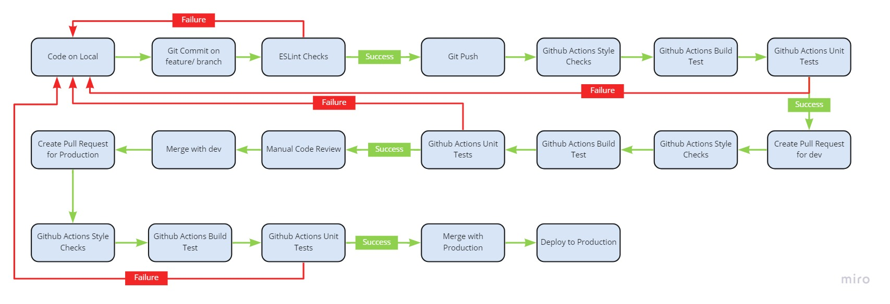

# // Two-Do

This is the repository for the Bullet Jouranl app created by Group 2. View our team page [here](./admin/team.md).

## About

Two-Do is a digital bullet journal system focused on delivering students with the best organisational tool to keep track of their day to day student life.

## CI/CD

### GitFlow

We will be using the GitFlow Workflow to develop the app. This means that we have a `dev` branch in  parrallel to the `master` branch. The `master` branch stores the official release history of the bullet journal while th edevelop branch serves as an integration branch for features

### Phase 1 Pipeline

For Phase 1 of our CI/CD Pipeline, we experimented with different tools to build, test, review and document code.

#### Style Enforcement

We are using ESLint to help check style rules for the Airbnb base style guide.

#### Build and Testing

We created jobs in our pipeline to automatically build and test code using npm scripts. For our automated testing suites, we chose Mocha and Chai since it gave us a wider range of tests and functionality than other testing suites for javascript.

#### Code Quality

We experimented with Codeclimate and Codacy to test our code quality but unfortunately we couldn't make them work since our repo is a private repository. We still need to look for tools that would allow us to incorporate code quality checks to our privcate organization.

As far as manual reviews are concerned, each pull request once passed all the checks must be reviewed before it can be allowed to be merged

#### Documentation

We experimented with the idea of creating a workflow to automatically generate documentations with JSDocs and use github actions to upload the documentation to github pages on a seperate `github-pages` branch and while we were able to get it running, the jsdoc node module had some vulnerabilities when introduced into our pre-existing node packages so moving forward that is one other issue we want to get figured out.

#### Pipeline

#### Video Demo

Click [here](./admin/cipipeline/phase1.mp4) to view a video demo of the pipeline

