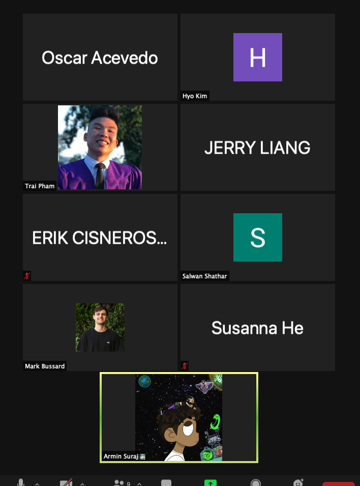

# Meeting Minutes
Team: Group 2\
Type: Retrospective Meeting\
Date: 05/15/2021\
Time: 12:00 - 1:00pm\
Location: Zoom

## Agenda
- Sprint 1 Retrospective Meeting

## Artifacts

## Attendance
- [x] Trai Pham
- [x] Armin Suraj
- [x] Erik Cisneros
- [x] Hyo Kim
- [X] Jerry Liang
- [x] Mark Bussard
- [x] Oscas Acevedo
- [x] Salwan Shathar
- [x] Susanna He

## Discussion
- Most Common Concerns:
  - not sure what task to work on next
  - lack of experience -> takes longer to complete a simple task
  - don't have clear roles in the group 
  - want more specific tasks (task descriptions) on github projects
- Most Common "Glad":
  - friendly teammates and no conflicts so far
  - initial design looks very clean for the wireframes
  - 

## Action Items
- need to write up next round of tasks for Sprint 2
- wait for tasks to be assigned individually 
- delete unncessary branches
- key focus: combining individual pages and make them consistent with the common theme
- start with the backend and javasript components + backend
