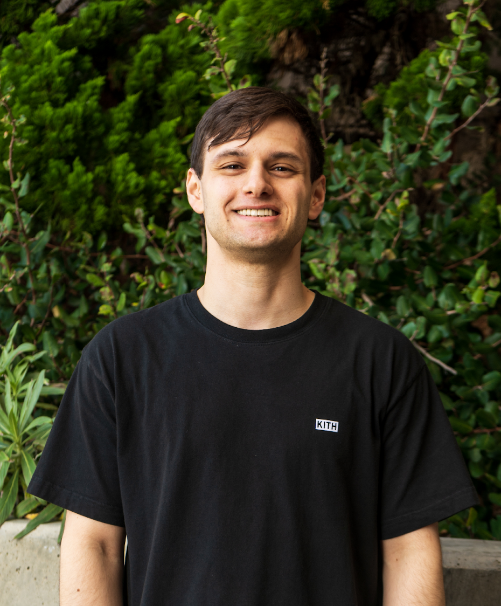
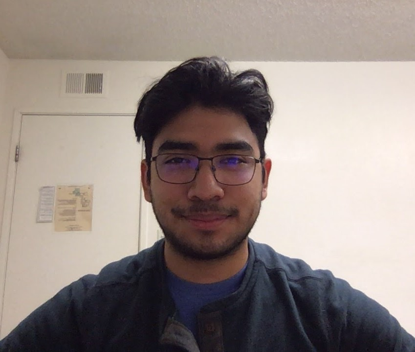

# // Two-Do

A bunch of sleep deprived students roped in to create an app agile-style.

## Team Values

We believe that trust and communication are one of the most important values to have in order for a team to be able to run successfully as a cohesive unit. We try to foster a fun environment for everyone to enjoy working with each other and develop ideas in a collaborative and efficient manner

## Team Members

 

**Name:** Armin Suraj

**Major/Year:** Computer Science / 2nd Year

**Hobbies:** Video Games, Procrastinating, Art

**Bio:**  I performed open-heart surgery on my dad at age 12, it's been touch and go ever since

**Profile:** [arm-out.github.io](https://github.com/arm-out/arm-out.github.io)

      

**Name:** Eric Cisneros

**Major/Year:** Computer Engineering / 3rd Year

**Hobbies:** Art, Video games, Anime

**Bio:**  I’m not scared of corporate espionage. If I don’t know what I’m doing, neither do my competitors.

**Profile:** https://ecisnero.github.io/

  

 

**Name:** Hyo Kim

**Major/Year:** Bioengineering / 4th Year

**Hobbies:** Baking, Learning guitar 

**Bio:**  I performed open-heart surgery on my dad at age 12, it's been touch and go ever since

**Profile:** https://hik010.github.io

    

**Name:** Jerry Liang

**Major/Year:** Computer Engineering / 3rd Year

**Hobbies:** Being sad, video games, rock climbing, driving

**Bio:**  I once jumped off two flights of stairs because I honestly thought I’d make it. I’ve never believed in myself again ever since.

**Profile:** https://jevanliang.github.io/CSE110/ 

  

 

**Name:** Mark Bussard

**Major/Year:** Computer Science / 3rd Year

**Hobbies:** Running, Working out, Video Games, Cooking

**Bio:**  Error 404

**Profile:** https://www.markbussard.com/

     

**Name:** Oscar Acevedo

**Major/Year:** Computer Science / 2nd Year

**Hobbies:**  Boxing, Cooking, Anime

**Bio:**  Think the reason why I like tetris so much is cause i let the work pile up, but i'm bad at tetris

**Profile:** https://origamimm.github.io/PagesProject/

  

 

**Name:** Salwan Shathar

**Major/Year:** Computer Engineering / 2nd Year

**Hobbies:**  Tennis, Music, Anime

**Bio:**  Will survive and that’s a fact, because my team and I got our backs

**Profile:** https://sal-iraqi.github.io/GitHub-Pages/

     

 

**Name:** Susanna He

**Major/Year:** Computer Science / 2nd Year

**Hobbies:**  Drawing, Video Games, Anime

**Bio:**  I have no idea what I’m doing

**Profile:** https://susannahe91.github.io/Lab1-GitHub-Pages/

    

**Name:** Trai Pham

**Major/Year:** Computer Science / 2nd Year

**Hobbies:**  Football, Working out, Video Games, Anime, Hiking

**Bio:**  I believe that empathy is a virtue that everyone should take into account. And I like cheesecake.

**Profile:** https://susannahe91.github.io/Lab1-GitHub-Pages/

